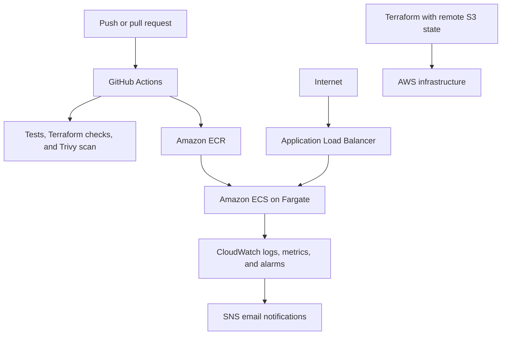
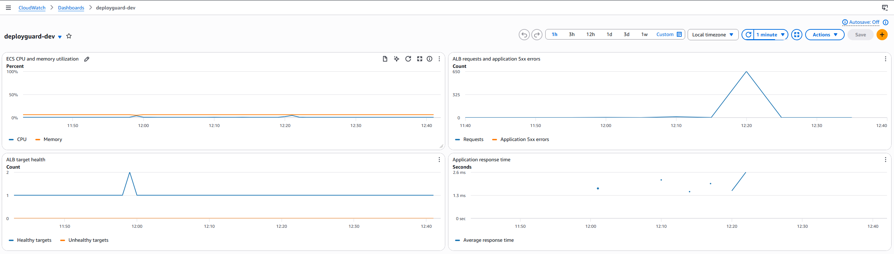

# DeployGuard

DeployGuard is a production-style CI/CD and cloud infrastructure project that demonstrates automated testing, container security scanning, AWS deployment, monitoring, failure detection, and automatic rollback.

The application is a lightweight FastAPI service. The project’s primary focus is the infrastructure and deployment system surrounding it.

## Architecture



## Features

- FastAPI health and version endpoints
- Structured JSON application logging
- Docker container running as a non-root user
- Automated Python tests with pytest
- Docker image builds in GitHub Actions
- Container vulnerability scanning with Trivy
- Terraform formatting and validation checks
- Remote Terraform state stored and locked in Amazon S3
- GitHub Actions authentication through AWS OIDC
- Immutable container images stored in Amazon ECR
- Automated deployment to Amazon ECS on AWS Fargate
- Application Load Balancer health checks
- ECS deployment circuit breaker with automatic rollback
- CloudWatch logs, metrics, dashboard, and alarms
- SNS email notifications for alarm and recovery events
- Grafana k6 smoke and load tests

## Deployment Flow

1. Code is pushed or merged into `main`.
2. GitHub Actions runs tests and security checks.
3. A Docker image is built and pushed to Amazon ECR.
4. The ECS task definition is updated with the new image.
5. ECS starts the new task behind the Application Load Balancer.
6. The ALB verifies the new task through health checks.
7. ECS completes the deployment or automatically rolls back if the task remains unhealthy.

## Failure Recovery

DeployGuard includes a controlled failure mode that makes a new deployment return `503` from its health endpoint.

During failure testing:

- The ALB detected the unhealthy task.
- ECS removed the unhealthy task and retried the deployment.
- The ECS deployment circuit breaker rejected the failed deployment.
- ECS rolled back to the previous healthy task definition.
- The public application remained healthy.
- CloudWatch transitioned from `OK` to `ALARM`.
- SNS delivered an email notification.
- CloudWatch returned to `OK` after recovery.

Failure testing also revealed that unhealthy-target datapoints were intermittent. The alarm was improved to trigger when at least one of three one-minute datapoints reports an unhealthy target.

## Load-Testing Results

Grafana k6 was used to generate a two-minute staged workload reaching 10 concurrent virtual users.

| Measurement | Result |
|---|---:|
| Requests | 650 |
| Successful checks | 650/650 |
| Failed requests | 0% |
| Average response time | 22.1 ms |
| 95th-percentile response time | 27.11 ms |
| Maximum response time | 68.48 ms |

The test produced no application 5xx errors, unhealthy targets, or excessive CPU usage.

[View the complete load-testing results](documentation/load-testing.md)



## Repository Structure

```text
app/              FastAPI application and logging configuration
tests/            Automated Python tests
infra/            Terraform infrastructure
load-tests/       Grafana k6 smoke and load tests
documentation/    Test results and supporting evidence
.github/workflows GitHub Actions CI/CD workflows
Dockerfile        Application container definition
```

## Run Locally

Create and activate a Python virtual environment:

```powershell
py -3.11 -m venv .venv
.\.venv\Scripts\Activate.ps1
python -m pip install -r requirements.txt
```

Start the application:

```powershell
python -m uvicorn app.main:app --reload
```

Run the tests:

```powershell
python -m pytest -v
```

The service will be available at `http://localhost:8000`.

## Run with Docker

```powershell
docker build -t deployguard:local .
docker run --rm -p 8000:8000 deployguard:local
```

## API Endpoints

| Endpoint | Purpose |
|---|---|
| `/` | Basic service response |
| `/health` | Load-balancer health check |
| `/version` | Deployed application version |

## Technology Stack

- Python 3.11
- FastAPI
- pytest
- Docker
- Grafana k6
- Terraform
- GitHub Actions
- Amazon VPC
- Amazon ECR
- Amazon ECS and AWS Fargate
- Application Load Balancer
- Amazon CloudWatch
- Amazon SNS
- Amazon S3
- AWS IAM and OIDC