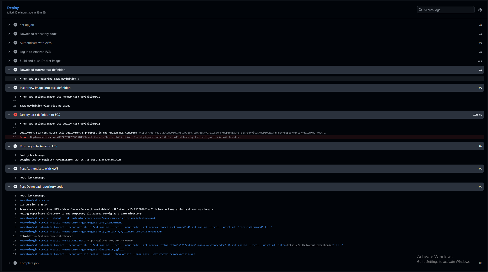

# Failure-Recovery Test

## Objective

Verify that DeployGuard detects an unhealthy deployment, prevents it from replacing the working application, automatically rolls back, and sends an operational alert.

## Failure Injection

The deployment workflow was manually started with `force_unhealthy` enabled. This configured the new container with:

```text
FORCE_UNHEALTHY=true
```

The application then intentionally returned HTTP `503` from `/health`.

## Expected Behavior

1. The Application Load Balancer rejects the unhealthy task.
2. The ECS deployment circuit breaker stops the failed deployment.
3. ECS rolls back to the previous healthy task definition.
4. CloudWatch detects the unhealthy target.
5. SNS sends an alert email.
6. The public application remains healthy.

## Initial Result

The deployment failed and ECS successfully rolled back. The service returned to:

- Desired tasks: 1
- Running tasks: 1
- Pending tasks: 0
- Primary rollout state: `COMPLETED`
- Public health endpoint: `healthy`

However, the unhealthy-target alarm did not trigger.

## Investigation

CloudWatch recorded intermittent unhealthy-target measurements:

```text
1, 0, 0, 1, 0, 0, 1
```

The original alarm required two consecutive unhealthy datapoints. ECS removed each unhealthy task before CloudWatch recorded two consecutive values of `1`, so the alarm remained `OK`.

## Fix

The alarm was changed to evaluate three one-minute periods and enter `ALARM` when at least one period reports an unhealthy target:

```hcl
evaluation_periods  = 3
datapoints_to_alarm = 1
```

## Verification

The controlled failure test was repeated after applying the fix.

- At 2:03 PM, CloudWatch transitioned from `OK` to `ALARM`.
- SNS delivered the unhealthy-target email notification.
- ECS removed the unhealthy tasks and rolled back.
- The existing application remained healthy.
- At 2:12 PM, CloudWatch transitioned from `ALARM` back to `OK`.

## Outcome

The test confirmed that DeployGuard can reject an unhealthy release, preserve the working application, automatically roll back, notify the operator, and recognize recovery.

It also demonstrated the importance of testing monitoring behavior against real deployment patterns instead of relying only on configuration validation.




[View the complete failure-recovery test](documentation/failure-recovery.md)