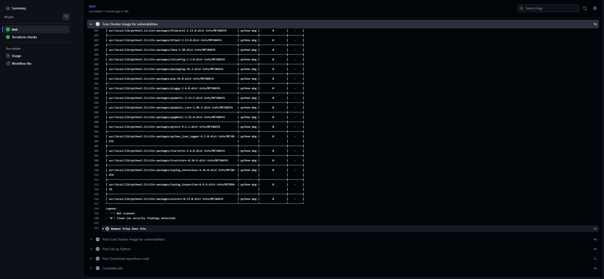

# Container Security Scanning

## Objective

Detect known vulnerabilities in the DeployGuard container image before changes can be merged or deployed.

## Implementation

The GitHub Actions CI workflow builds the application’s Docker image and scans it with Trivy.

The scan examines the operating-system packages and application dependencies included in the image. Running the scan in CI makes container security part of the normal pull-request process instead of a separate manual task.

## Verification

The Trivy scan completed successfully and reported no configured blocking security findings.

Because the scan runs inside the required CI job, a blocking vulnerability would cause the job to fail and prevent the pull request from satisfying branch protection.

## Additional Security Controls

DeployGuard also uses:

- A non-root user inside the application container
- AWS OIDC instead of long-lived AWS access keys in GitHub
- Least-privilege permissions for the GitHub deployment role
- Immutable Amazon ECR image tags
- Security groups that allow ECS application traffic only from the load balancer
- Encrypted remote Terraform state in Amazon S3

## Evidence

